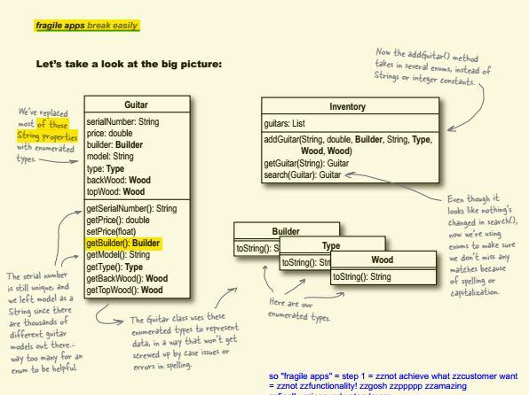
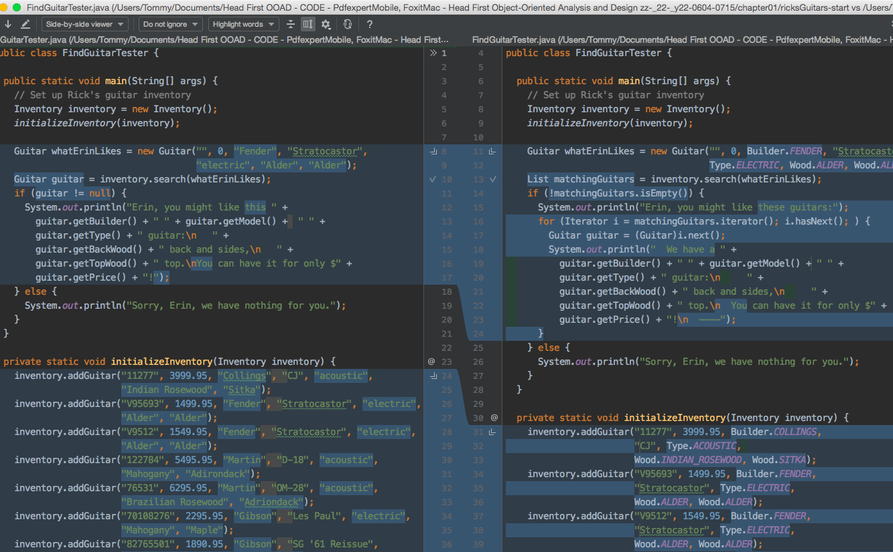
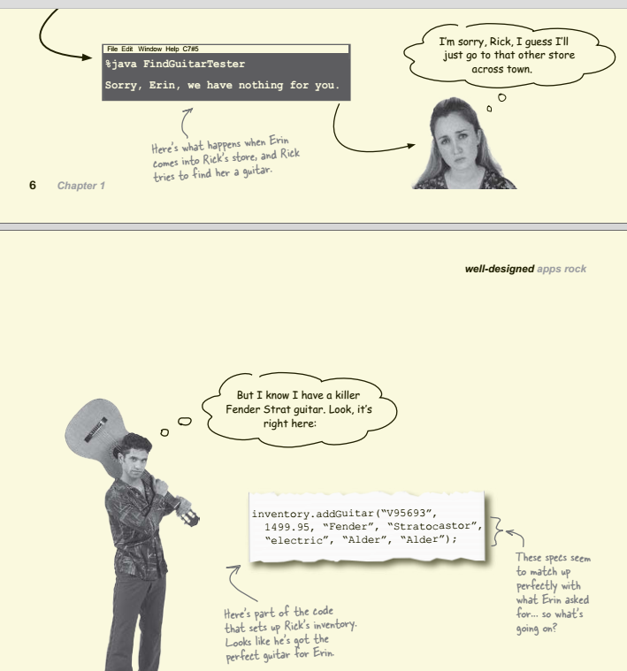
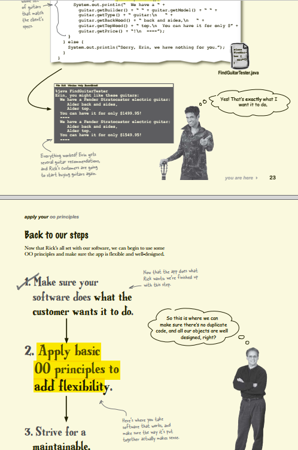

### Problem 
- case matching in string!  
    - p15: *Right. We can just remove all those strings, and the string comparisons, to avoid this whole case-matching thing*

### Solution(s)
- 🚨 can do "toLowerCase()" but it is still string comparison! - p16
    - so Enum's switch case - that all capital is really ENUM comparison, not anymore a string!  
    - p17 - *methods or classes that use them are protected from any values not defned in the enum. So you can’t misspell or mistype an enum without getting a compiler error. It’s a great way to get not only type safety, but value safety* 
        - "value safety" zzFirstTime zzcool zzPowerful - zzNOT just zztype zzsafety! ((🔶 zzppppp-_22-_y22-0605-0710
- 🚨🚨 p18 - change only at Guitar & Inventory, really the test class (consumer, client) has minimal change! 
    - 📒 zzCmt: zzUML zzMeaningful as zzCodeReview really give zzclean and zzclear zzAdvice  
    - 
    - also test class only changes for initialize inventory & input - but how inventory search part, it does NOT
     impact test class! ((❇️ zzppp-_22-_y22-0605-0750 zznice zzBeautiful 
        - 

### code critique 
- 🚨 p8 - "this design is terrible! The Inventory and Guitar classes depend on each other too much" (#coupled, #depend)

### code study note 
- zzIntrst - actually "search" not change! but only Guitar getType changes implementation INSIDE! ((❇️ zzppp-_22-_y22-0605-0725
    - zzClassic-zzEx-zzEx-zzGood about "hide implementation by encapsulation" so consumer does NOT need to change
     - ex: that search in the test class - really no need to change! it's guitar class itself needs to change
     ! zzBeautiful ((⛔️ zzpppppppp-_22-_y22-0605-0740 zzsavour-the-zzcode-zzBeautiful-zzengineering-as-zzart-and-zzdancing-zzmusic-zztmy-zzphiloso
- why "choices" means it now returns a list 
    - also see p.8 on OOAD book - it's a requirement change 
        - 
    - [FindGuitarTester.java:13](FindGuitarTester.java)
    - 🚨 also in Inventory, search method uses "List" type, instead of directly return single guitar 
- in search, no more string compare, but use Enum
- p22. zzIntrst see he really puts zzFunctionality zzneed to "zzmake zzcustomer zzHappy" as the zztop
 zzFirstClassCitizen -zzFrontSeat-zzUseful-zzMentalModel zzPowerful - zzAgile zzspirit! - then only after that you do the zzDesign! 
    - *Q: And why is it so important to fnish Step 1 before going on to Step 2? A: You’re going to make lots of changes to your software when you’re getting it to work right. Trying to do too much design before you’ve at least got the basic functionality down can end up being a waste, because a lot of the design will change as you’re adding new pieces of functionality to your classes and methods*
- p23. zzWOW now only finished "makes customer happpy", not even the zzOOAD zzOOP zzDesign zzPrinciple yet
! ((🔶 zzppppp-_22-_y22-0605-0802 zzsurprise! 
    -  
